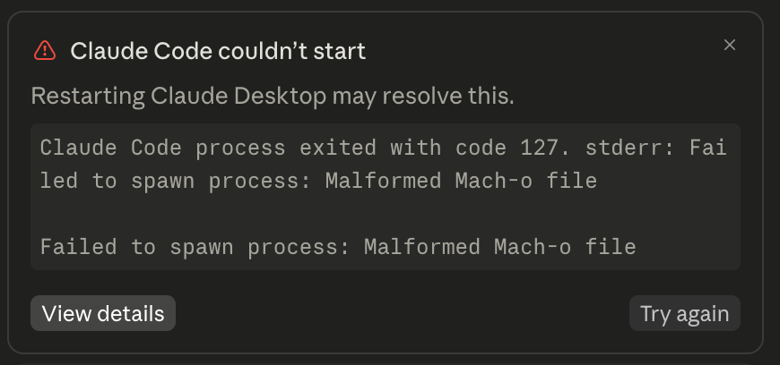
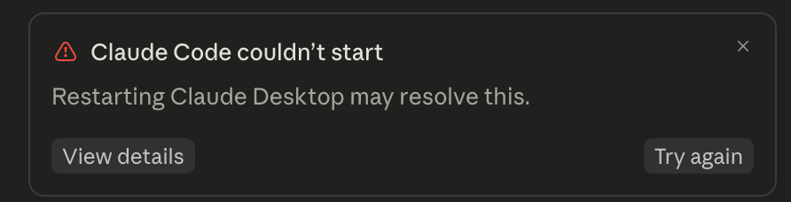

# Claude Desktop — Correctif « Malformed Mach-o file » / intégrité ASAR (macOS)

🌐 **Lire ceci dans une autre langue :** [English](../README.md) · [فارسی](README.fa.md) · [العربية](README.ar.md) · [中文](README.zh.md) · [Español](README.es.md) · [हिन्दी](README.hi.md) · [Français](README.fr.md) · [Русский](README.ru.md) · [Português](README.pt.md) · [Deutsch](README.de.md) · [日本語](README.ja.md)

Un correctif et une explication pour deux plantages liés qui peuvent survenir sur **Claude
Desktop pour macOS** après que `app.asar` (le code applicatif empaqueté de Claude Desktop) a
été modifié — que ce soit par un correctif tiers, un plugin, une modification manuelle,
ou toute autre méthode qui reconditionne ou édite le bundle de l'application.

Ceci n'est **pas** spécifique à un patcheur ou à un outil en particulier. Tout projet qui
extrait, édite et reconditionne le fichier `app.asar` de Claude Desktop peut déclencher l'un
ou l'autre de ces deux problèmes (voire les deux) s'il ne gère pas correctement deux
détails spécifiques à macOS/Electron. Ce dépôt documente les deux causes profondes et
fournit un script de réparation en une seule commande.

---

## Symptôme 1 — L'onglet Claude Code ne démarre pas




```
Claude Code couldn't start
Restarting Claude Desktop may resolve this.

Claude Code process exited with code 127. stderr: Failed to spawn process: Malformed Mach-o file

Failed to spawn process: Malformed Mach-o file
```

Seul l'**onglet Claude Code** échoue. Le reste de Claude Desktop (chat, etc.)
fonctionne normalement.

## Symptôme 2 — L'application entière ne se lance pas

```
[FATAL:electron/shell/common/asar/asar_util.cc:144] Integrity check failed
for asar archive (139796d9f05e1667a633fdc5dab1f565760ef18a4584202fdcddc9a94717db6a
vs eb74792783f1d924ccdba5e302805b10e95fa1ff0c6dd04794ba452c14ee2d52)
```

Rien ne s'ouvre du tout — le processus s'interrompt immédiatement au lancement. Vous ne
verrez ce message que si vous exécutez l'exécutable de Claude Desktop directement depuis un
terminal (`/Applications/Claude.app/Contents/MacOS/Claude`) ; un double-clic sur
l'application échoue simplement en silence.

---

## Causes profondes

### 1. Un binaire natif s'est retrouvé empaqueté *dans* `app.asar` au lieu de rester déballé sur le disque

Les applications Electron conservent certains fichiers — modules natifs (`*.node`),
bibliothèques dynamiques (`*.dylib`), et tout autre binaire d'assistance natif — physiquement
déballés sur le disque, à côté de `app.asar`, dans un répertoire voisin `app.asar.unpacked/`.
Tout le reste vit empaqueté à l'intérieur du fichier d'archive unique `app.asar`.

Si un script de reconditionnement décide de ce qui doit rester déballé en se basant sur une
liste **codée en dur** d'extensions de fichiers (un motif courant :
`{*.node,*.dylib,spawn-helper}`), tout binaire natif qui ne correspond pas — par exemple un
binaire d'assistance pour l'onglet Claude Code qui est livré sans l'une de ces extensions —
se retrouve empaqueté *à l'intérieur* de l'archive à la place. Une entrée d'archive n'est pas
un véritable fichier exécutable indépendant : le système d'exploitation ne peut pas faire
`exec()` sur une plage d'octets au milieu d'un autre fichier et en obtenir un programme
valide. Quand Claude Desktop tente de lancer ce binaire, le système lit un morceau d'octets
non aligné sur un fichier et le signale comme un Mach-O corrompu/invalide — d'où le message
« Malformed Mach-o file ».

**Correctif :** ne codez pas en dur la liste des fichiers à déballer. Calculez-la
dynamiquement à partir de ce qui est *déjà* déballé à côté du `app.asar` d'origine avant de
toucher à quoi que ce soit, et utilisez ce même ensemble lors du reconditionnement. Voir
[`lib/unpack.js`](../lib/unpack.js) pour une implémentation prête à l'emploi, et vérifiez
après reconditionnement que rien n'a disparu.

### 2. Re-signature sans avoir d'abord supprimé les anciennes signatures imbriquées

Modifier des fichiers à l'intérieur de `app.asar` invalide les signatures de code imbriquées
des sous-bundles déjà signés qui l'accompagnent (`Contents/Frameworks/*.framework`,
`Contents/Frameworks/*.app` helpers, `Contents/Helpers/*`, services XPC intégrés, etc.) —
mais ne supprime pas ces signatures obsolètes. Exécuter `codesign --force --deep --sign -`
par-dessus peut laisser le bundle dans un état incohérent :

```
$ codesign --verify --deep --strict /Applications/Claude.app
/Applications/Claude.app: nested code is modified or invalid
file modified: .../Claude Helper (GPU).app
file modified: .../Electron Framework.framework
...
```

L'étape de *signature* elle-même signale un succès (« replacing existing signature ») —
l'échec n'apparaît qu'au moment du `--verify`, ce qui est facile à manquer si vous ne
vérifiez pas explicitement.

**Correctif :** exécutez d'abord `codesign --remove-signature --deep` pour supprimer toutes
les signatures imbriquées, *puis* signez à partir de zéro. Voir
[`lib/macos.js`](../lib/macos.js).

### 3. Le fusible d'intégrité ASAR intégré d'Electron

C'est celui qui provoque le Symptôme 2 (l'application entière ne se lance pas). Electron
dispose d'un « fusible » (fuse) au moment de la compilation —
`EnableEmbeddedAsarIntegrityValidation` — qui, lorsqu'il est activé, intègre le hash SHA-256
attendu de `app.asar` directement dans le **binaire Electron Framework**
(`Contents/Frameworks/Electron Framework.framework/Electron Framework` sur macOS — *pas*
l'exécutable principal de l'application dans `Contents/MacOS/`, et *pas* une éventuelle clé
`ElectronAsarIntegrity` que vous pourriez trouver dans `Info.plist`, laquelle est un
mécanisme distinct et sans rapport, hérité, que certains outils de build écrivent
également).

Une fois `app.asar` modifié, le hash intégré ne correspond plus, et Electron plante
brutalement au lancement au lieu de se dégrader proprement.

Recalculer et corriger ce hash intégré à la main n'est pas envisageable — cela fait partie
d'un format spécifique de « câblage de fusibles » binaire, aux côtés de plusieurs autres
indicateurs. La solution prise en charge consiste à désactiver entièrement le fusible en
utilisant l'outillage propre à Electron, [`@electron/fuses`](https://www.npmjs.com/package/@electron/fuses) :

```bash
npx --yes @electron/fuses write --app /Applications/Claude.app EnableEmbeddedAsarIntegrityValidation=off
```

Cela modifie le binaire Electron Framework, ce qui invalide sa signature — vous devez
resigner l'ensemble du bundle par la suite (le correctif de la cause profonde n°2 s'en
charge).

---

## Correctif rapide — vous avez déjà une installation cassée ?

Si vous avez simplement besoin de réparer le `Claude.app` que vous avez déjà (vous n'avez pas
besoin de savoir lequel des problèmes ci-dessus vous a touché — ceci corrige les deux) :

### En un clic (sans terminal)

1. [Téléchargez ce dépôt](https://github.com/<your-username>/claude-macho-fix/archive/refs/heads/main.zip) et décompressez-le.
2. Double-cliquez sur **`Fix Claude.command`**.
3. Une fenêtre de terminal s'ouvre, vous guide à travers chaque étape, et propose de
   relancer Claude Desktop pour vous une fois terminé.

macOS peut avertir que le fichier provient d'un développeur non identifié la première
fois — faites un clic droit dessus et choisissez **Ouvrir** pour contourner cela une fois.

### En une ligne (terminal)

```bash
curl -fsSL https://raw.githubusercontent.com/<your-username>/claude-macho-fix/main/repair.sh | bash
```

Ou clonez et exécutez-le localement :

```bash
git clone https://github.com/<your-username>/claude-macho-fix.git
cd claude-macho-fix
./repair.sh
```

`repair.sh` détecte automatiquement `Claude.app` (ou `Claude Beta.app`) dans les
emplacements d'installation habituels, le quitte s'il est en cours d'exécution, parcourt
chaque étape de réparation avec une sortie claire de réussite/échec, vérifie le résultat, et
propose de relancer l'application pour vous. Passez un chemin explicitement si la vôtre se
trouve à un endroit inhabituel :

```bash
./repair.sh "/path/to/Claude Beta.app"
```

`repair.sh` ne modifie **pas** les fonctionnalités ou le contenu réels de Claude Desktop —
il ne fait que désactiver le fusible d'intégrité et resigner le bundle. Il est sûr à
exécuter même si vous n'êtes pas sûr du symptôme dont vous souffrez, et sûr à exécuter
plusieurs fois. S'il ne peut pas écrire dans le bundle de l'application, il vous demandera
de le relancer avec `sudo`.

---

## Si vous développez votre propre patcheur

Si vous écrivez un outil qui modifie `app.asar` (pour la localisation, le thème, des
plugins, ou toute autre raison), vous pouvez éviter de transmettre ces bugs à vos
utilisateurs dès le départ. Ce dépôt inclut des modules documentés, prêts à l'emploi :

- [`lib/unpack.js`](../lib/unpack.js) — calcule le glob `unpack` correct pour la fonction
  `createPackageWithOptions` de `@electron/asar`, dynamiquement, à partir de ce qui est déjà
  déballé. Remplacement direct d'une liste d'extensions codée en dur.
- [`lib/macos.js`](../lib/macos.js) — resigne correctement un bundle d'application macOS
  (supprime d'abord les signatures imbriquées, puis signe à partir de zéro, puis vérifie).
- [`lib/fuses.js`](../lib/fuses.js) — désactive le fusible d'intégrité ASAR intégré
  d'Electron à l'aide de `@electron/fuses`.

Les trois sont écrits en Node.js pur, avec peu de dépendances, et agnostiques de tout
framework — ils ne font aucune supposition sur *ce à quoi* vous adaptez Claude Desktop, ils
supposent seulement que vous reconditionnez `app.asar` et resignez le bundle par la suite.

```js
const { computeUnpackGlob, collectUnpackedRelativePaths } = require('./lib/unpack');
const { reSignMacApp } = require('./lib/macos');
const { disableAsarIntegrityFuse } = require('./lib/fuses');

// 1. Before extracting/patching, snapshot what's currently unpacked:
const unpackGlob = computeUnpackGlob(asarPath);

// 2. ...extract, patch, repack app.asar using `unpackGlob` for the `unpack` option...

// 3. Disable the integrity fuse and re-sign the whole bundle:
await disableAsarIntegrityFuse(appPath);
reSignMacApp(appPath);
```

---

## Pourquoi ce n'est pas un bug de Claude Desktop

Pour être clair : Claude Desktop se comporte correctement ici. Le fusible d'intégrité ASAR
d'Electron et la signature de code macOS sont *censés* rejeter un bundle d'application
modifié — c'est tout leur intérêt. Ce dépôt existe pour les personnes qui ont délibérément
choisi de modifier leur propre copie locale de Claude Desktop (pour l'accessibilité, la
localisation, ou d'autres raisons personnelles légitimes) et qui souhaitent que leur
correctif désactive/mette également à jour correctement les mécanismes qui l'empêcheraient
autrement de fonctionner, plutôt que de les laisser à moitié cassés.

## Contribuer

Les issues et les PR sont les bienvenues. Si vous rencontrez une variante de ce bug qui
n'est pas couverte ci-dessus, merci d'inclure :
- Le message d'erreur exact (journal de plantage de Console.app ou sortie terminal issue de
  l'exécution directe de `Contents/MacOS/<AppName>`)
- `codesign -dv --verbose=4 /Applications/Claude.app`
- L'outil/correctif que vous utilisiez lorsque cela s'est cassé

## Licence

MIT
